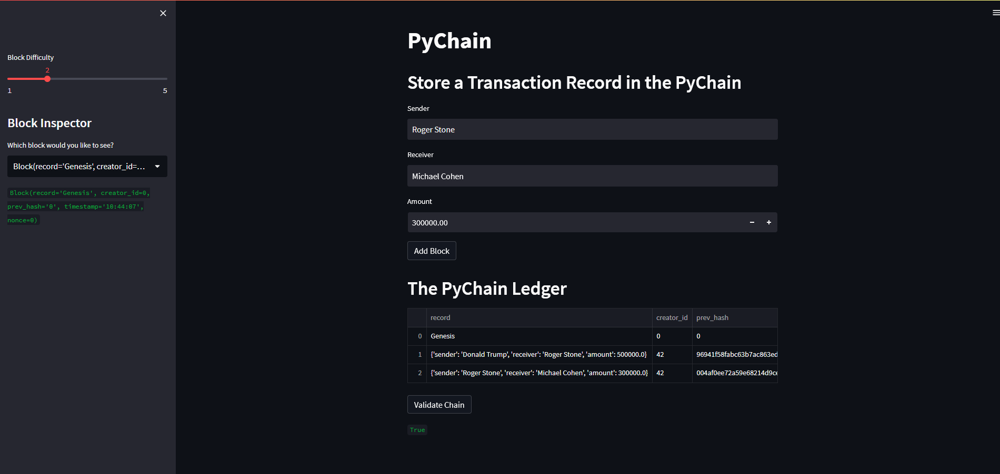
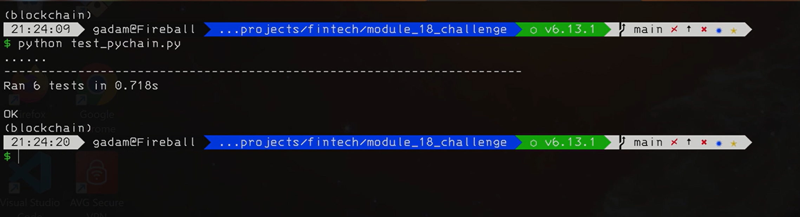
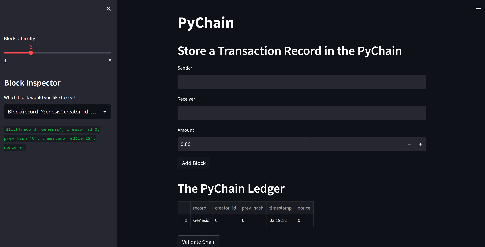
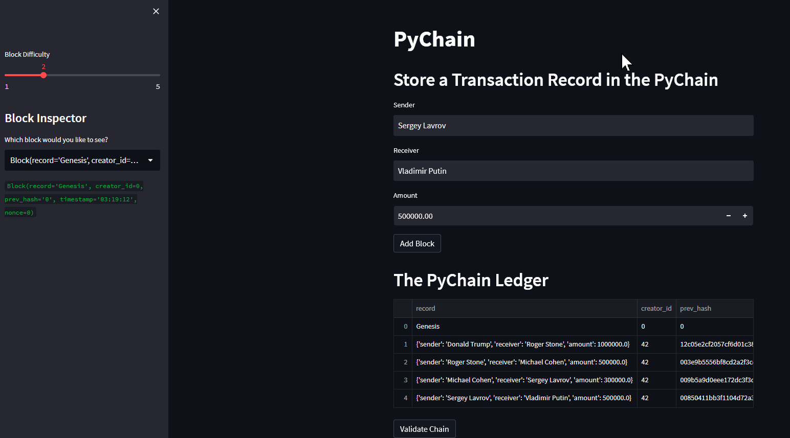
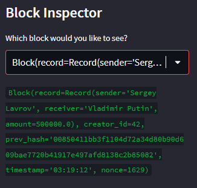
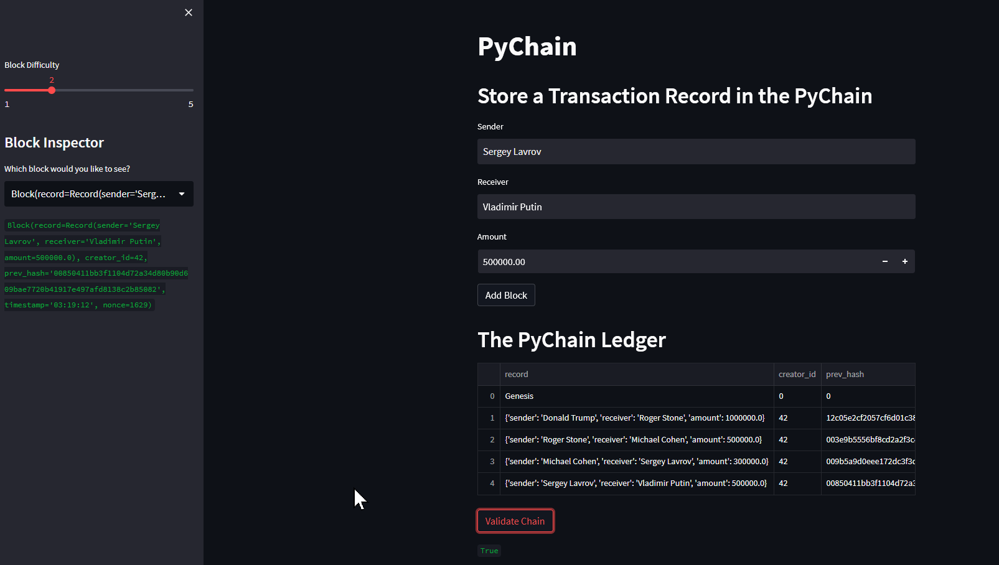

# Module 18 Challenge - PyChain Ledger

This application creates a blockchain-based ledger system, complete with a user-friendly web interface. The ledger allows partner banks to conduct financial transactions between senders and receivers and verifies the integrity of the data in the ledger.

## Design Approach
This application is organised into 3 files:

1. A `pychain.py` module file containing the class definitions for all the objects and methods to build and validate the `pychain` ledger
2. A `test_pychain.py` unit test file that performs automated unit testing of the classes and methods defined in `pychain.py` and
3. Finally a `pychain_ui.py` file containing the user interface using the `streamlit` library to manage the ledger via a web page

## The `pychain.py` Module
The `pychain.py` module contains 3 classes:
* `Record`
* `Block`
* `PyChain`

The `Record` class simply holds the `sender`, `receiver` and `amount` attributes and forms the basis of a `block` in the `pyledger chain`.  It has no methods.

The `Block` class knows how to construct a block in the `pyledger` utilising the `Record` data structure, capturing the `creator_id`, the hash encoding of the previous block, timestamp and the `nonce` value that is used to identify which miner (if there are more than 1) will be allowed to mine the block and add it to the blockchain.

This class will also hash any candidate blocks using the `SHA-256` encoding algorithm.

The `PyChain` class is responsible for managing the build and validation of the blockchain.  It maintains a list of blocks, i.e. its `ledger`.  Upon receiving an instruction to add a block, it first performs a `proof_of_work` check to confirm that the requester has solved the `nonce` puzzle then adds the block to the ledger using the `Block` class methods.

`PyChain` also validates the integrity of the ledger by traversing the entire ledger and checking that the hashed links are valid.

## Streamlit UI
File `pychain_ui.py` makes use of the `streamlit` library to present the user with a web-based interface allowing the user to see the `PyChain` ledger entries and examine the contents of each record individually.  In addition, the user interface includes a `Validate` button that initates a validation of the entire `PyChain` ledger.

## Testing

### Unit Testing
Testing was performed in two parts:
* Automated unit testing
* Functional testing via the `streamlit` user interface

To run the automated unit test file, use the command `python test_pychain.py`.
The unit testing script `test_pychain.py` contains 6 separate unit tests that are run each time the above command is executed and reports any failures to the console.  If there are no failures, the command shows the number of tests run and indicates `OK`.  Any failed test cases are also reported allowing diagnosis and remediation.  This script can be updated and run whenever the application is modified to see if the changes have any impact on existing functionality.  As shown in the screenshot below, there are currently no errors in the unit testing suites.

### Functional Testing
Functional testing was conducted via the web-based user interface where each of the application's capabilities were exercised.  To run the web-based user interface, use the command `streamlit run pychain_ui.py`.

#### Adding new transactions
The screenshot below show the page prior to transactions being added with just the initital `Genesis` block present.  The `Genesis` block is created upon application startup.

The screen below shows the ledger after 4 transactions have been added.

#### Examining the last block
The screen below shows the details of the last block created in the ledger via the `Block  Inspector`:

#### Validating the Ledger
The ledger can be validated by selecting the `Validate Chain` button.  Results are shown below:
